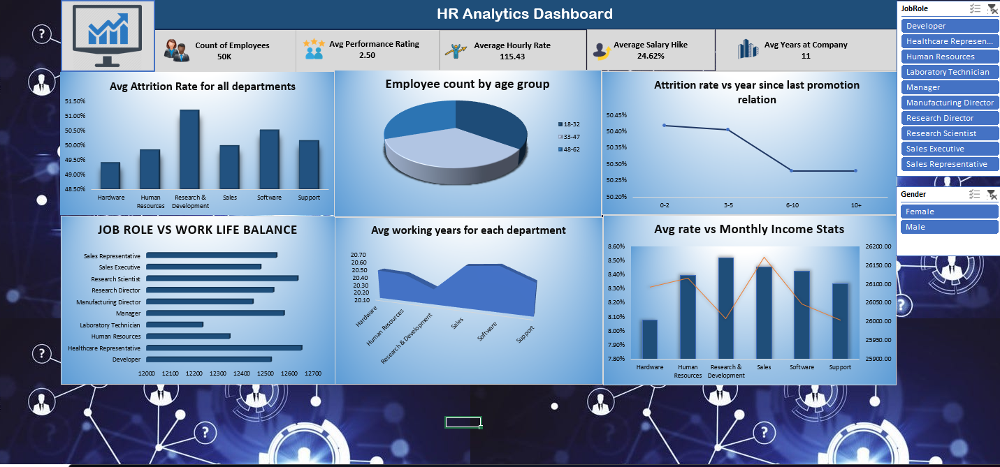

# 📊 HR Analytics Dashboard (Excel)

An interactive HR Analytics Dashboard built using Microsoft Excel to analyze employee data and uncover insights related to attrition, performance, and workforce distribution.

---

## 🔍 Overview

This project focuses on understanding key HR metrics through a visually structured dashboard. It helps identify patterns in employee attrition, salary trends, and job role distribution.

---

## 📌 Key Features

* 📉 Attrition analysis across departments
* 👥 Employee distribution by age group
* 💰 Average monthly income vs attrition rate
* 🏢 Work-life balance by job role
* 📊 KPIs: Employee Count, Attrition Rate, Salary Hike %, Performance Rating

---

## 🛠 Tools & Skills Used

* Microsoft Excel
* Pivot Tables & Pivot Charts
* Slicers for interactivity
* Data Cleaning & Transformation
* Dashboard Design

---

## 📷 Dashboard Preview

---

## 📁 Project Files

* `HR_Analytics_Dashboard.xlsx`
* `hr-analytics-dashboard.png`

---

## 💡 Insights Derived

* Certain departments show higher attrition rates
* Work-life balance varies significantly across job roles
* Income levels influence employee retention trends

---

## 🚀 How to Use

1. Download the Excel file
2. Open in Microsoft Excel
3. Use slicers to filter data dynamically
4. Explore insights from different perspectives

---

## 📬 Contact

Feel free to connect with me for feedback or collaboration.
